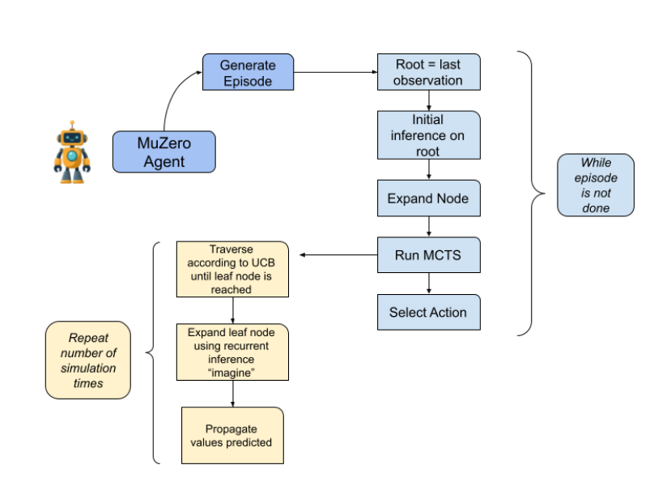

# Muzero-for-Powergrids

Reinforcement Learning (RL) faces challenges in large-scale problems like Optimal Power Flow (OPF) due to high-dimensional continuous action spaces that make scaling difficult. To overcome this, we propose a model-based RL approach where we analyze the MuZero algorithm to enable long-term planning. 

To train the MuZero agent, you can run the `agents/MuZero/muzero_agent.py` file.

# MuZero Algorithm

## Self-Play

During self-play, the agent's goal is to simulate an episode using MCTS. At each episodic step, it sets the root of the MCTS to be the last observation in the episode using the Initial Inference method.  
This method first converts the raw observation into a hidden state using the representation network. It then uses this hidden representation to predict the value and policy of the state using the value network and policy network respectively.  

Using the predicted policy, it generates the children of the node, where the edge represents the action index and the child node's prior stores the probability of the action.  
Before running MCTS, we add exploration noise sampled from a Dirichlet distribution to these priors:

$$
\text{prior}_a^{\text{new}} = (1 - \eta) \cdot \text{prior}_a^{\text{old}} + \eta \cdot \epsilon_a
$$

where  
- $\eta =$ root exploration fraction, set to 0.25  
- $\epsilon = (\epsilon_1, \dots, \epsilon_k) \sim \text{Dirichlet}(\alpha, \dots, \alpha)$  
- $\alpha =$ Dirichlet concentration, set to 0.3  
- $k =$ number of available actions (487)  

---

### Monte Carlo Tree Search (MCTS)

MCTS is then performed on the root node (last observation) $n$ times, where $n$ is the number of simulations.  
In each simulation, the agent traverses the tree by picking the action with the highest UCB score until reaching a leaf node:

$$
\text{UCB}(c) = \Bigg( \log\Big(\frac{N_p + c_{\text{base}} + 1}{c_{\text{base}}}\Big) + c_{\text{init}} \Bigg) \cdot \frac{\sqrt{N_p}}{N_c + 1} \cdot \pi_c + \text{value component}
$$

The value component is normalized using min-max statistics:

$$
\text{value component} =
\begin{cases} 
\frac{(r_c + \gamma V_c) - \text{min}}{\text{max} - \text{min}}, & N_c > 0 \text{ and } \text{max} > \text{min} \\
r_c + \gamma V_c, & N_c > 0 \text{ and } \text{max} = \text{min} \\
0, & N_c = 0
\end{cases}
$$

where:  
- $N_p$ = parent node’s visit count  
- $N_c$ = child node’s visit count  
- $\pi_c$ = prior probability of child $c$  
- $c_{\text{base}} = 19652$, $c_{\text{init}} = 1.25$  
- $r_c$ = reward of transitioning to child  
- $V_c = \frac{\text{value\_sum}_c}{N_c}$  
- $\gamma = 0.9$ = discount factor  

---

### Recurrent Inference

Once reaching a leaf node, MuZero applies recurrent inference:  
- The dynamics network takes in the parent hidden state + one-hot encoded action, outputs the next hidden state.  
- The reward network predicts the reward for the transition.  
- The value and policy networks predict the value and policy of the new state.  

The new node is then backpropagated up the tree.  

After $n$ simulations, the next action is sampled from the visit count distribution:

$$
p_c = \frac{e^{v_c}}{\sum_{i=1}^k e^{v_i}}, \quad 
\tilde{p}_c = \frac{p_c^{1/\tau}}{\sum_{i=1}^k p_i^{1/\tau}}
$$

where $\tau$ is a temperature parameter that decreases over training.

---

## Training

Training starts by sampling episodes from the replay buffer.  
For each sampled observation, we unroll it $t$ steps and compute target value, reward, and policy.  

Target value $z_t$ is:

$$
z_t = \sum_{i=0}^{\min(\text{td\_steps}, T - t) - 1} \gamma^i r_{t+i} \;+\; \gamma^{\text{td\_steps}} V_{t + \text{td\_steps}}
$$

- $r_{t+i}$ = reward at step $t+i$  
- $\gamma = 0.9$ = discount factor  
- $\text{td\_steps} = 7$ = temporal difference horizon  
- $V_{t + \text{td\_steps}}$ = bootstrap value  

Target policy at step $t$ is the normalized visit count distribution:

$$
\pi_t(a) = \frac{N_t(a)}{\sum_{a'} N_t(a')}
$$

The loss function is a weighted sum of value, reward, and policy losses with L2 regularization:

$$
\mathcal{L}_{\text{total}} = \sum_{u=0}^T \Big( 
(\hat{v}_u - z_u)^2 + (\hat{r}_u - r_u)^2 - \sum_a \pi_u(a) \log \hat{\pi}_u(a) 
\Big) + \lambda \|\theta\|^2
$$

---

## Algorithm

